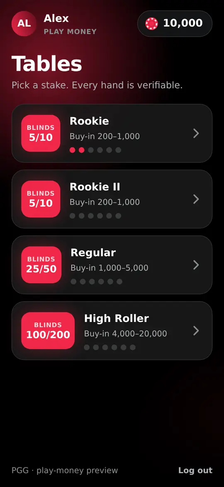
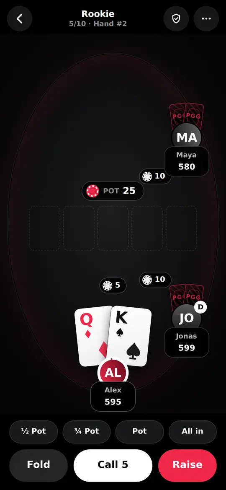
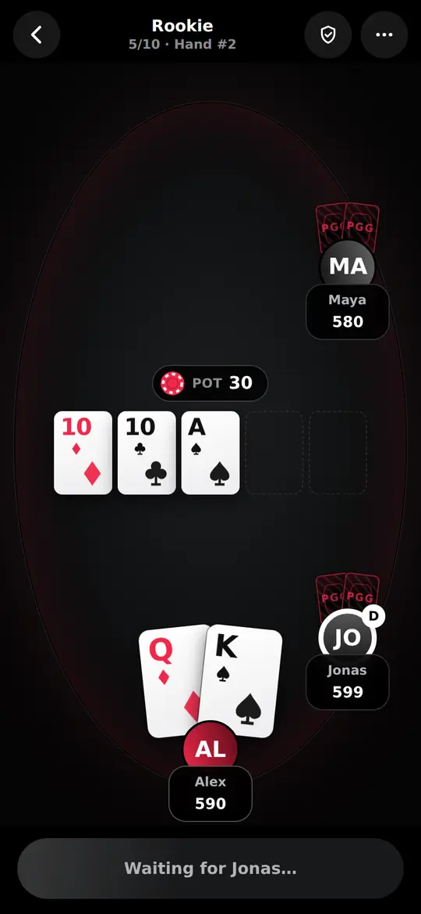
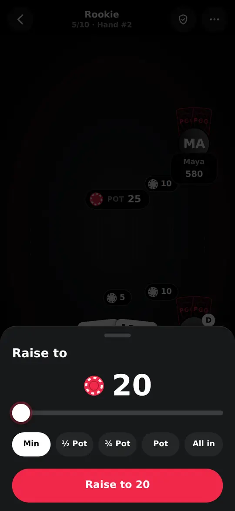

# PGG

Mobile-only Web3 poker. Players join Texas Hold'em tables from a phone browser; the game runs off-chain
on a fast Bun server, and (Milestone 2) money sits in a non-custodial escrow contract.

Derived from [pok3rNetwork/pok3r](https://github.com/pok3rNetwork/pok3r) (MIT), see [NOTICE](NOTICE).
Plain JavaScript (ES modules) everywhere; only the contracts will be Solidity.

<p>
  
  
  
  
</p>

## Status

**Milestone 1 (play-money vertical slice) is done.** You can open the app on a phone, pick a table, and
play full hands against other people or bots, with a verifiable shuffle for every hand.

**There is no real-money path yet, and none will be enabled** before an independent contract audit and
legal review. Milestone 2 is the Foundry escrow, wallet connection, session keys and deposits (Polygon,
BSC); Milestone 3 is scale-out and audit prep. See [docs/architecture.md](docs/architecture.md).

## Layout

| Path | What |
| --- | --- |
| `packages/engine` | Hold'em table (betting via `poker-ts`), our own settlement, commit-reveal dealer, rake. Only `@pgg/engine/fairness` is browser-safe. |
| `packages/protocol` | zod schemas for every client-server message; `./constants` is dependency-free for the web. |
| `apps/server` | Hono + Bun WebSocket game server, load-test and bot tooling. |
| `apps/web` | Mobile-only React client (Vite, Tailwind, motion). Desktop gets a QR code. |
| `contracts/` | Foundry escrow (Milestone 2). |
| `docs/` | Architecture, measured capacity, `poker-ts` findings. |

## Run it

```sh
bun install

# development: two processes, Vite proxies /api and /ws to the game server
bun run dev:server              # game server on :8787
bun run dev:web                 # phone UI on :5173

# or one process: the game server also serves the built app
bun run build:web
WEB_DIST=apps/web/dist PGG_SECRET=change-me bun apps/server/src/index.js   # http://localhost:8787
```

Open it **on a phone** (same network, using your computer's address). A desktop browser shows a QR code
instead; add `?desktop=1` to the URL to bypass that while developing, or use browser dev tools in a
phone-sized touch mode.

## Check it

```sh
bun test                        # engine, server (incl. real WebSocket end-to-end) and web logic
bun run lint
bun run size                    # initial download budget (after build:web)
bun run shots                   # drives a phone-sized Chromium through the whole app and saves screenshots
bun run loadtest -- --tables 300 --clients 3 --seconds 15 --think 150
```

`FUZZ_HANDS=8000 FUZZ_SEED=1 bun test packages/engine -t fuzz` runs the engine fuzzer much longer.

## Configuration

Environment variables for the server (all optional): `PORT` (8787), `PGG_SECRET` (signs login tokens;
set it, or logins reset on every restart), `WEB_DIST`, `TURN_MS`, `INTER_HAND_MS`, `START_BALANCE`,
`WATCHDOG_MS`, `RATE_CAPACITY`/`RATE_REFILL`, `CORS_ORIGINS`.
